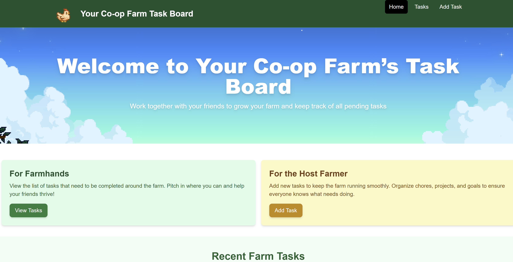

# Stardew Valley Co-op Task Board

This project is a Stardew Valley-themed web application that allows co-op farm members to share and track tasks. Host farmers can post new tasks, and farmhands can view pending tasks and help each other complete them, making farm management more fun and collaborative.



## Features

- **Co-op Farm Lobby:** Enter your unique farm code to ensure tasks remain private to your co-op group.
- **View Tasks:** Browse a list of ongoing tasks, each with its own category, description, deadline, and reward.
- **Add Tasks:** Hosts can create new tasks to keep the farm running smoothly, specifying details such as category and deadline.
- **Thematic UI:** Designed with a Stardew Valley-inspired color palette, textures, and iconography for an immersive feel.

## Getting Started

1. **Install Dependencies:**
   ```bash
   npm install
   ```
2. **Run Development Server: The app will run at http://localhost:3000.**
   ```bash
   npm run dev
   ```
3. **Build for Production:**
   ```bash
   npm run build
   ```

## Contributing

Contributions are welcome! Feel free to open an issue or submit a pull request to improve features, user experience, or thematic elements.